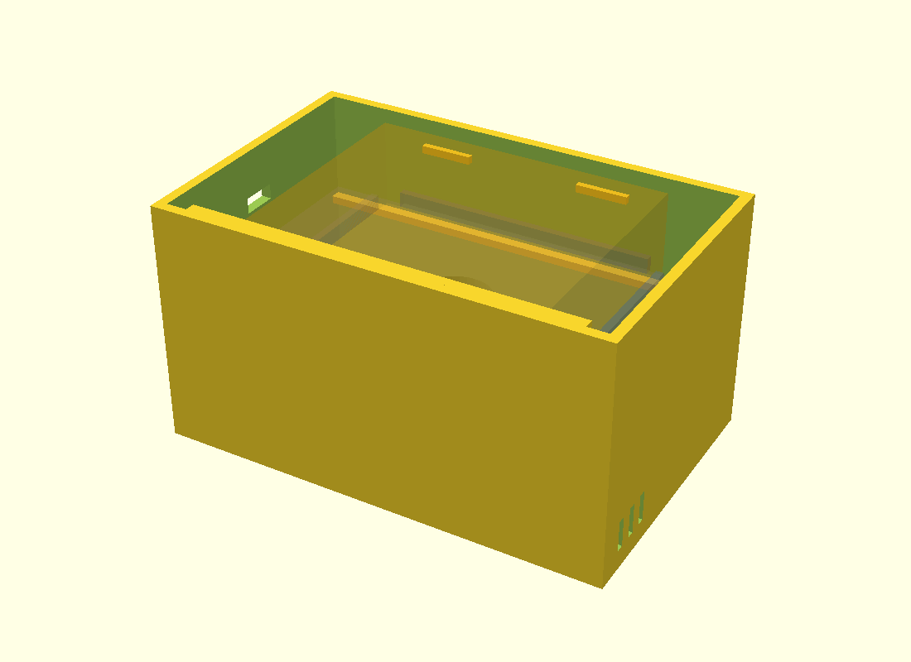
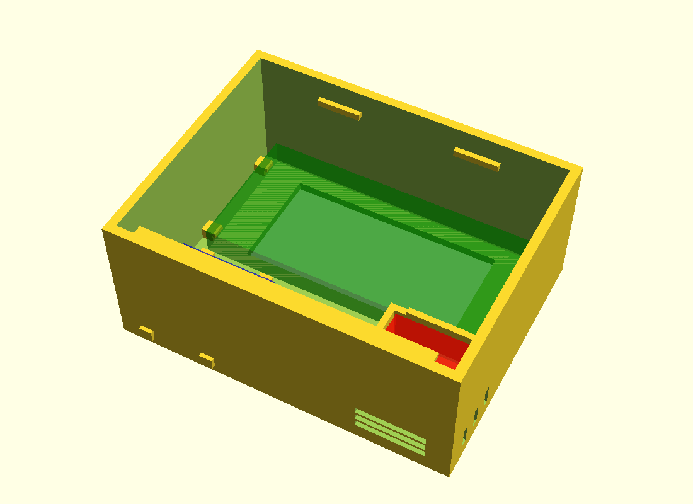

# co2_detector

A battery-powered indoor air-quality monitor built from off-the-shelf parts. It measures CO2, temperature and relative humidity, keeps a history on flash and draws the current CO2 level and graphs on an e-Paper screen. Hardware and firmware are assembled and working; screen design is still being refined (see [STATUS.md](STATUS.md)).

<p>
  
  
</p>

## Hardware

- **MCU:** ESP32-S3 SuperMini (4 MB flash)
- **Sensor:** Sensirion SCD41 (NDIR CO2, temperature, humidity) over I2C, single-shot measurements
- **Display:** Waveshare 2.13" e-Paper (250×122, GxEPD2 `BN` driver) over SPI
- **Input:** one button that cycles through the screens
- **Power:** 3×AA battery box with a switch, into the board's 5V pin

## Firmware

- PlatformIO + Arduino framework (`platformio.ini`, `src/main.cpp`).
- Deep sleep between measurements (every 15 minutes), light sleep while the SCD41 measures, CPU at 80 MHz during the active phase, the sensor powered down before sleep, e-Paper refreshed only when needed. The on-board LEDs were physically removed to cut idle current.
- Measurements stored in LittleFS as fixed-size binary records with file rotation; graphs for 1 h / 24 h / 7 days.
- Estimated battery life: about 8–10 months on alkaline AA and about a year on lithium AA. This is calculated from datasheets ([POWER.md](POWER.md)); it has not yet been confirmed by a full run on batteries.

## Tests

Hardware-independent logic lives in `lib/logic/` and is covered by Unity unit tests that run on the host, including an integration test on a synthetic month of data:

```bash
pio test -e native
```

Build and flash:

```bash
pio run -e esp32-s3-supermini -t upload
```

## Case

A 3D-printed FDM case modelled in OpenSCAD: [`box/case.scad`](box/case.scad) with the exported [`box/case.stl`](box/case.stl) (body, shelf and lid). Measured component dimensions are in [box/DIMENSIONS.md](box/DIMENSIONS.md).

## Repository layout

| Path | Contents |
|---|---|
| `src/` | Firmware (`main.cpp`, screen bitmaps) |
| `lib/logic/` | Pure logic: validation, downsampling, averages, navigation, alert hysteresis |
| `test/test_logic/` | Unity tests |
| `box/` | OpenSCAD case model, STL, renders |
| `Дизайн экрана/` | Screen design sources (PNG) |
| `Печать/` | Print-ready STL parts |

## Documentation (in Russian)

- [STATUS.md](STATUS.md): current state and remaining work
- [BRINGUP.md](BRINGUP.md): step-by-step assembly and hardware bring-up
- [POWER.md](POWER.md): power budget and battery-life estimate
- [BOX.md](BOX.md): case design and printing

## Кратко по-русски

Автономный монитор CO2, температуры и влажности на ESP32-S3 SuperMini, датчике SCD41 и e-Paper экране Waveshare 2.13", питание от 3×AA. Прошивка на PlatformIO/Arduino с глубоким сном и оптимизацией энергопотребления (расчётно 8–10 месяцев на щелочных батарейках), юнит-тесты логики на Unity, корпус для 3D-печати в OpenSCAD. Подробности в STATUS.md, BRINGUP.md, POWER.md и BOX.md.
